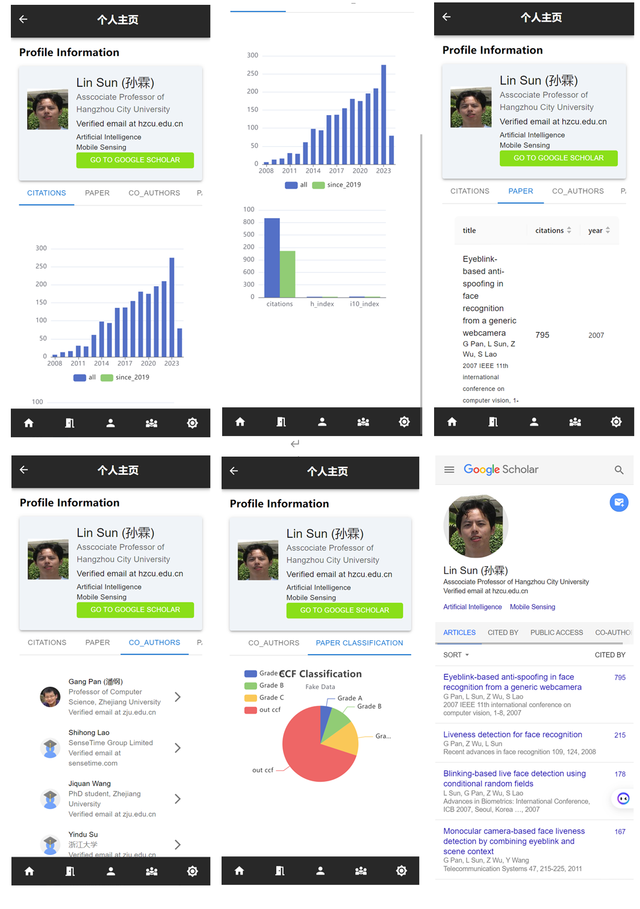

# Description

基于网页端，用于识别人脸检测用户的学术背景。部署于本地局域网。

# Start

## front end

```
yarn start
```


index.js 更改本地网络ip地址

```
//cmd查询本地ip
ipconfig  //output is xxx
```

```js
//区分开发环境还是生产环境基础URL
export const basicUrl = isPrd ? 'xxx': 'xxx'
```


# back end

```js
npm start
```


/controllers/googleCOntroller 需要修改google scholar API的key

```js
const apiUrl = 'https://serpapi.com/search';
const apiKey = '45157b0e5933ddb546971e35028ec8c92f8e296cf23dbe4d5f379747dbb7b11e'; //google scholar API官网申请
```

/config.env 修改自己mongodb数据库账号密码

```js
NODE_ENV=development
PORT=8900
DATABASE=mongodb+srv://fatdove:<password>@cluster0.drvhgpe.mongodb.net/fatdove?retryWrite=true
DATABASE_PASSWORD=''
JWT_SECRET=veryComplexSecretKey12345!

```


# process



